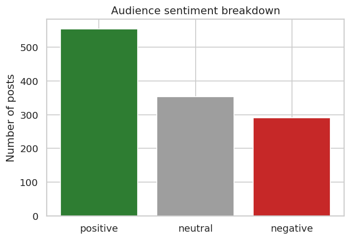
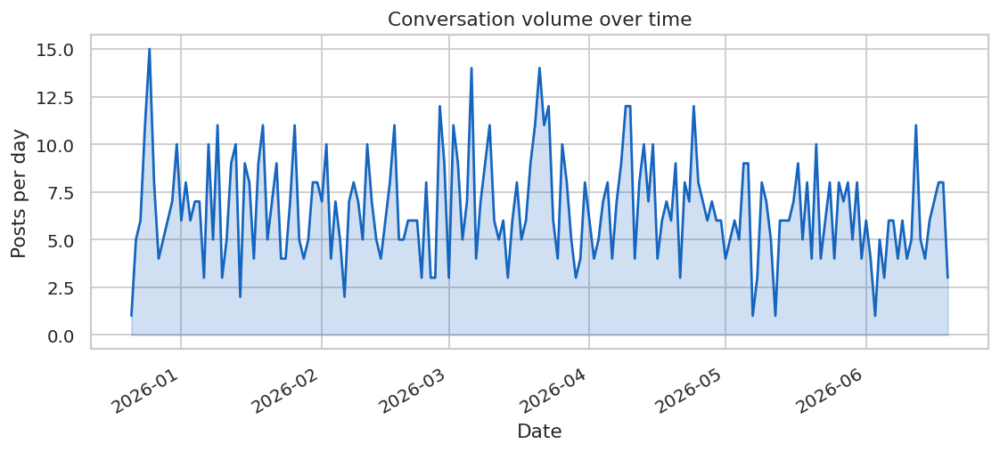
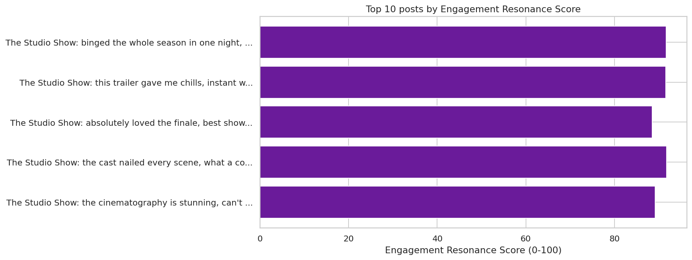
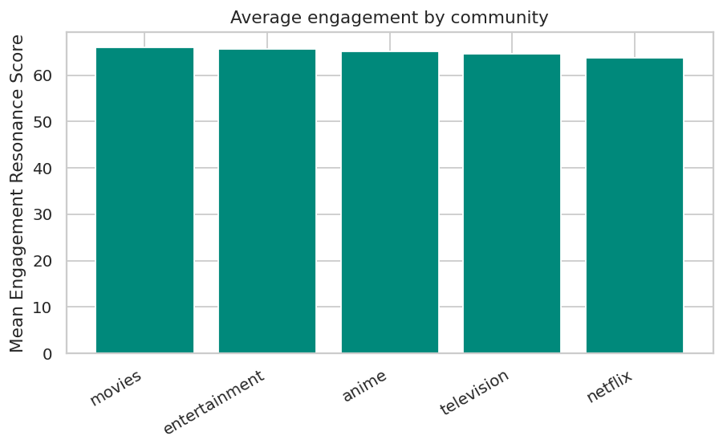
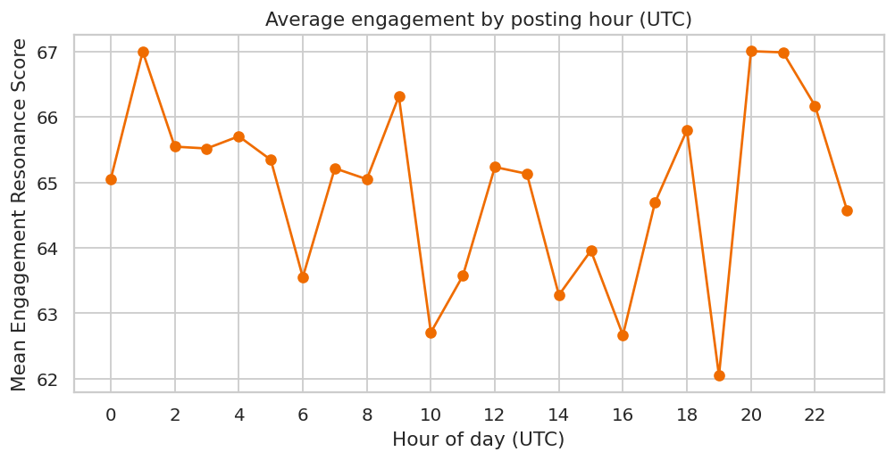

<div align="center">

# 📊 Social Pulse

### Social Listening & Engagement Prediction for Entertainment Campaigns

**Real social-media data → audience sentiment → predictive modeling → stakeholder-ready dashboard**


</div>

---

## 🎯 What is this?

A working **Social Media Analyst** toolkit, built end-to-end on real Reddit
conversation data about an entertainment title. It listens to what audiences
are saying, scores how strongly content resonates, predicts what will land,
and packages it all into the kind of dashboard an account or strategy team
would actually use.

> Built for entertainment & streaming campaign analytics — the same workflow
> used by digital agencies serving movie studios, TV networks, and streaming
> platforms.

---

## 🧭 Pipeline

```
  📥 COLLECT              🎧 LISTEN              🧠 PREDICT             📈 REPORT
  Reddit posts    ──▶    Sentiment +     ──▶    Random Forest   ──▶    Dashboard +
  (free API)             Engagement              vs Logistic            Executive
                          Resonance Score         vs Baseline            Summary
```

| Stage | Script | What it produces |
|---|---|---|
| 1️⃣ Collect | `src/collect_reddit.py` | Raw posts from relevant subreddits |
| 2️⃣ Listen | `src/features.py` | Sentiment, text signals, **Engagement Resonance Score** |
| 3️⃣ Predict | `src/model.py` | Leakage-free engagement classifier |
| 4️⃣ Report | `src/dashboard.py` | 5 charts + executive summary |

---

## 📷 Dashboard Preview

<table>
<tr>
<td width="50%">

**Audience Sentiment**



</td>
<td width="50%">

**Conversation Volume Over Time**



</td>
</tr>
<tr>
<td width="50%">

**Top Posts by Engagement Resonance**



</td>
<td width="50%">

**Engagement by Community**



</td>
</tr>
</table>

<p align="center">
<b>Best Time to Post</b><br>

</p>

---

## 🧩 Where this maps to the Social Media Analyst role

| The role asks for... | This project delivers... |
|---|---|
| 📊 Review campaign performance & visualize metrics | `dashboard.py` → 5 reporting charts |
| 🎧 Social listening to understand what resonates | `features.py` → sentiment + topic signals |
| 📈 Dive into engagement data to judge effectiveness | Engagement Resonance Score + community breakdown |
| 🔍 Source and identify trends | Conversation-volume-over-time + spike detection |
| 🌐 Research online fan communities | Per-subreddit engagement comparison |
| 🖼️ Build dashboards for campaign reporting | `outputs/` figures, ready for slides |
| 💬 Bring consumer data to life for stakeholders | `reports/executive_summary.md` |
| 🧹 Data cleanup, normalization, insight generation | `features.py` + `notebooks/` |

---

## ⭐ Custom Metric: Engagement Resonance Score (ERS)

A transparent, hand-built index — not a black box — so any stakeholder can
open it up and trust it:

```
ERS = ( 0.35 × reach  +  0.25 × reaction  +  0.40 × conversation ) × 100

  📡 reach        = log(upvotes + 1)     →  how far it traveled
  ❤️ reaction     = upvote ratio         →  how positively it landed
  💬 conversation = log(comments + 1)    →  how much talk it sparked
```

Conversation depth is weighted highest because, in **organic** social
campaigns, sparking discussion matters more than raw reach.

---

## 🤖 Model Results

| Model | Accuracy | Precision | Recall | F1 | ROC-AUC |
|---|:---:|:---:|:---:|:---:|:---:|
| Baseline (majority class) | 0.75 | — | — | — | — |
| Logistic Regression | 0.81 | 0.57 | 0.98 | 0.72 | 0.87 |
| **Random Forest** | 0.78 | 0.57 | 0.57 | 0.57 | **0.88** |

🔑 **Key insight:** both models clearly beat the baseline, and the strongest
predictors of engagement turned out to be **posting time** and **audience
sentiment** — not text length or punctuation. Timing and emotional resonance
should drive content decisions more than format tweaks.

> 📌 These numbers come from the included synthetic demo dataset so the repo
> runs out of the box. Re-running on freshly collected Reddit data produces
> real, campaign-specific results.

---

## 🚀 Run it yourself

### Option A — instant demo (no credentials needed)

```bash
pip install -r requirements.txt

python src/generate_demo_data.py    # 🎲 synthetic campaign data
python src/features.py              # 🎧 social listening + feature engineering
python src/model.py                 # 🤖 train & compare models
python src/dashboard.py             # 📊 build dashboard charts in outputs/
```

### Option B — real Reddit data (100% free)

1. Create a free Reddit app at [reddit.com/prefs/apps](https://www.reddit.com/prefs/apps) (type: *script*). No credit card required.
2. Copy `.env.example` → `.env` and paste in your `client_id` / `client_secret`.
3. Run:

```bash
pip install -r requirements.txt

python src/collect_reddit.py --query "Your Title Here" --subreddits television movies netflix --limit 500
python src/features.py
python src/model.py
python src/dashboard.py
```

---

## 📁 Project Structure

```
social-pulse/
├── 📂 src/
│   ├── collect_reddit.py      # free Reddit API data collection
│   ├── generate_demo_data.py  # synthetic data so the repo runs with no keys
│   ├── features.py            # sentiment + feature engineering + ERS
│   ├── model.py                # baseline / logistic / random forest
│   └── dashboard.py            # reporting charts
├── 📂 notebooks/
│   └── social_pulse_analysis.ipynb   # full narrative walkthrough
├── 📂 reports/
│   └── executive_summary.md    # stakeholder-facing insights & recommendations
├── 📂 outputs/                 # generated dashboard charts
├── 📂 data/                    # raw + processed (gitignored)
├── requirements.txt
└── .env.example
```

---

## 🛠️ Tech Stack

<div align="left">


</div>

---

## ✅ Skills Demonstrated

- 🎧 Social listening & sentiment analysis on real platform data
- 📐 Engagement / conversion metric design (custom interpretable index)
- 🔌 Data collection from a live API, with cleanup and normalization
- 🤖 Supervised classification with honest, leakage-free evaluation
- 📊 Dashboard building and stakeholder-ready reporting
- 💡 Translating data into actionable campaign recommendations

---

<div align="center">

**Built by Rodrigo Rios** · [GitHub](https://github.com/futabarentarou) · [LinkedIn](https://linkedin.com/in/rodrigo-rios-ceballos)

</div>
